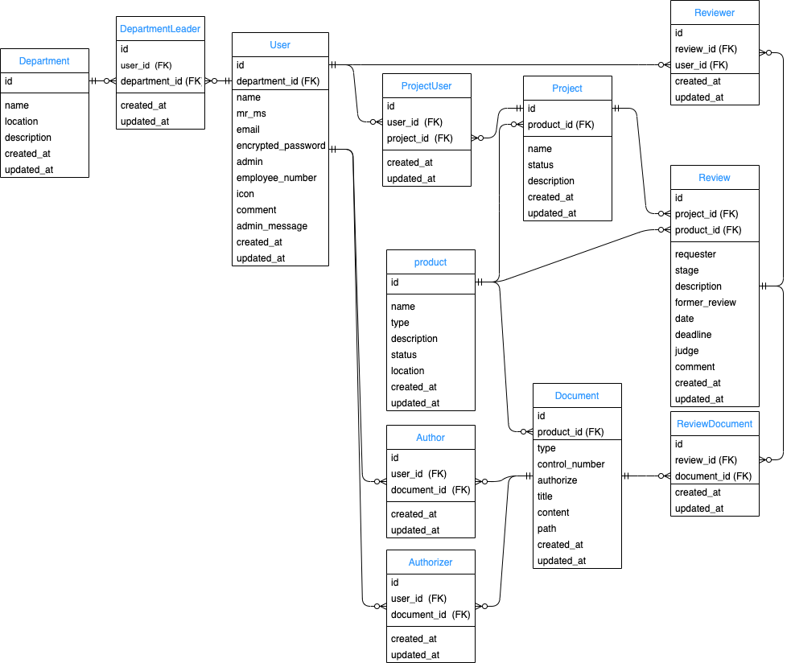
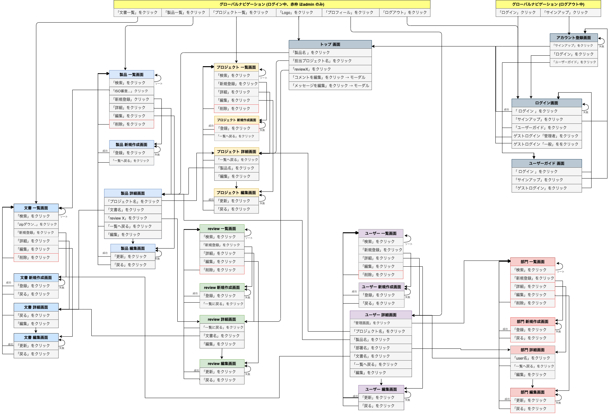

# README

## アプリ概要
製造業の技術文書プラットフォーム「Tech Document Hub」

### アプリ作成の背景
この業務、システム化すれば人間がやる必要ないのでは? 前職でそのように感じる場面が多くありました。<br>
最もムダだと感じたことは、**重要な技術文書を、ネットワークフォルダで人間が管理していること**でした。<br>
品質規格のISO審査を受ける時は特に大変です。あの文書がない、このバージョンではない等、様々な問題がおこります。<br>
**システム化されたプラットフォームで技術文書を管理**すればそんな問題は解決できる。そう考えて作成に至りました。

### このアプリを導入するメリット
- 品質に関する国際規格 ISO9001の審査に必要な技術文書を簡単に取得できる
- Design Reviewのプロセスをシステムに落とし込み、技術文書と紐付けて一元管理する
- アプリ上に技術文書を投稿、閲覧できるようにして、メールによる文書配布を減らす


## 開発言語
- Ruby2.6.5
- Rails5.2.5

## 就職Termの技術
- devise
- Ajax (承認、コメント機能)


## カリキュラム外の技術
- ransack

## その他の技術
- kaminari
- bootstrap
- carrierwave
- mini_magick


## 実行手順
```
$ git clone git@github.com:o5411980/tech_document_hub.git
$ cd tech_document_hub
$ bundle install
$ rails db:create
$ rails db:migrate
$ yarn add jquery
$ rails s
```
## カタログ設計
[カタログ設計](https://docs.google.com/spreadsheets/d/1D7LluP8UTfq4_VnRRmOjcXbqda8tJ9lRP-vIZdVH9Ow/edit?usp=sharing)

## テーブル設計
[テーブル設計](https://docs.google.com/spreadsheets/d/1D7LluP8UTfq4_VnRRmOjcXbqda8tJ9lRP-vIZdVH9Ow/edit?usp=sharing)

## ER図  
[画像リンク](https://drive.google.com/file/d/1aSuncwrSrecR00lg1o7VfjsmJpYcmCOJ/view?usp=sharing)


## 画面遷移図  
[画像リンク](https://drive.google.com/file/d/1sOr9LaEKm9Wu_lmMlYpSI_eqJbaf5XMZ/view?usp=sharing)


## ワイヤーフレーム
[画像リンク](https://drive.google.com/file/d/1hd_KE79VbueAOYegy1BB5slUrS-rDCT0/view?usp=sharing)
